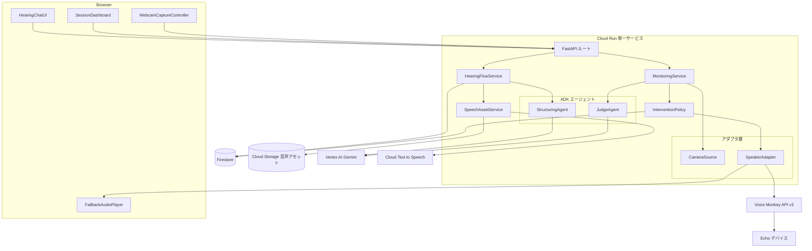
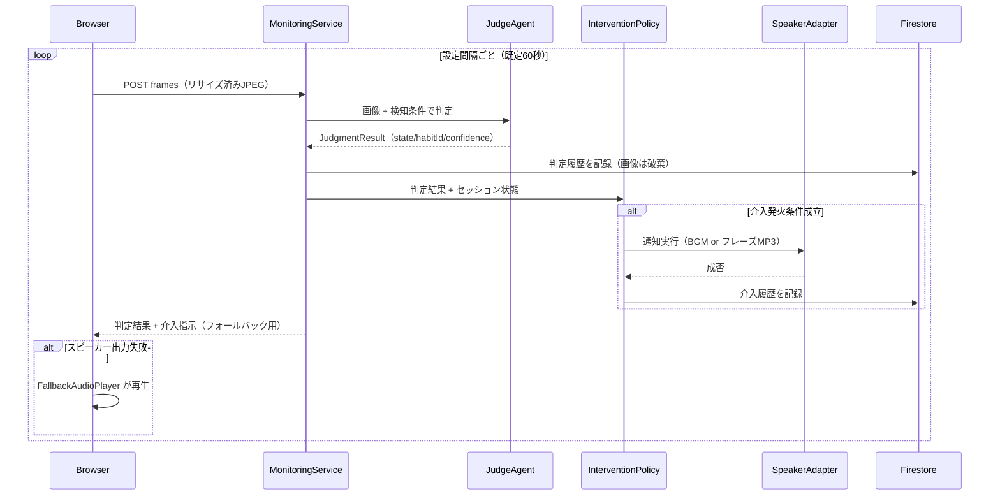
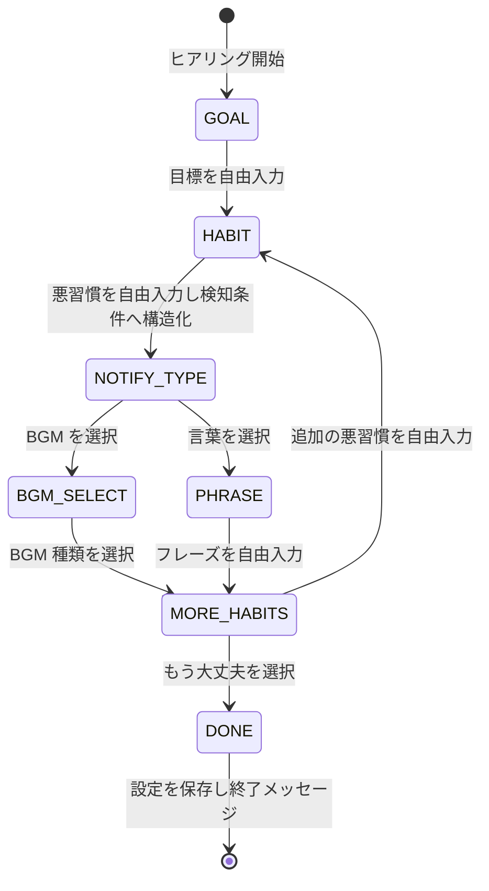

# 技術設計ドキュメント: focus-guardian-agent

## 概要

**目的**: Focus Guardian は、集中したい作業に取り組むユーザに対し、Web カメラ画像の自律的な観察・判定と、ユーザが事前に選んだ通知（BGM / 言葉）の実行によって、サボり行動からの復帰を支援する。

**ユーザー**: 資格勉強等の集中作業を行う個人ユーザが、固定フローのヒアリングで監視設定を作成し、集中セッション中の自動監視・介入を受ける。

**影響**: 新規プロダクト（グリーンフィールド）。DevOps × AI Agent Hackathon 2026 の提出要件（Cloud Run 稼働、公開リポジトリ、CI/CD、審査期間中の稼働維持）を満たす。

### 目標
- ヒアリング → 観察 → 判定 → 介入（1回）→ 結果記録のループを単一 Cloud Run サービスで完結させる
- 自由入力の悪習慣を Gemini で画像判定可能な検知条件に構造化し、ユーザごとに異なる監視対象を扱えるようにする
- カメラ入力（Web カメラ → 将来 Nest Cam）と介入出力（Alexa → 将来 Google Home）を設定変更のみで差し替え可能にする
- 提出締切 2026/7/10 に間に合う実装規模に抑える

### 非目標
- 介入手段のエスカレーション・効果学習による戦略調整（要件から除外済み）
- Nest Cam / Google Home の実装（インターフェースの用意のみ）
- マルチユーザー認証・アカウント管理（匿名の単一ユーザ利用を前提。ブラウザ localStorage の匿名 ID で設定を紐付け）
- BGM の常時ストリーミング再生（Voice Monkey の仕様上 ~240 秒のクリップ再生とする）

## アーキテクチャ

### アーキテクチャパターンと境界マップ



**アーキテクチャ統合**:
- 選択したパターン: **単一 Cloud Run サービス + ポート/アダプタ（ヘキサゴナル軽量版）**。判定パイプライン（ドメイン）は `CameraSource` / `SpeakerAdapter` のポートにのみ依存し、Web カメラ / Voice Monkey は差し替え可能なアダプタ（代替案の比較は `research.md` 参照）
- ドメイン境界: ヒアリング（設定作成）と監視セッション（判定・介入）は独立したドメイン。共有点は Firestore 上の監視設定ドキュメントのみ
- 新規コンポーネントの根拠: 各コンポーネントは要件領域 1〜8 に 1:1 で対応（トレーサビリティ表参照）
- エージェント設計の根拠: `StructuringAgent` / `JudgeAgent` は output_schema 専用の単発実行 ADK LlmAgent とし、介入発火は決定的な `InterventionPolicy` が担う。ADK の output_schema + tools 併用制約と Cloud Run のセッション消失リスクを回避する（判断の詳細は `research.md` の設計判断参照）

### 技術スタック

| レイヤー | 選定 / バージョン | 機能における役割 | 備考 |
|----------|-------------------|-------------------|------|
| フロントエンド | TypeScript + Vite + React 18 | ヒアリングチャット、ダッシュボード、カメラキャプチャ、フォールバック再生 | ビルド成果物を FastAPI の静的配信で同居 |
| バックエンド | Python 3.12 / FastAPI / google-adk v2.3 | API・固定フローステートマシン・エージェント実行 | `get_fast_api_app()` に独自ルートを追加する公式パターン |
| AI | Vertex AI 経由 Gemini `gemini-2.5-flash-lite` | 画像の行動分類、悪習慣の検知条件構造化 | ADC 認証・学習不使用・enum 構造化出力。モデル名は環境変数で明示 |
| AI（音声） | Cloud Text-to-Speech | 通知フレーズの日本語 MP3 生成 | Voice Monkey の ja-JP TTS 未確認リスクの回避策 |
| データ | Firestore (Native mode) | 監視設定・セッション・判定履歴・介入履歴 | 画像は保存しない |
| ストレージ | Cloud Storage（公開読み取りバケット） | 生成 MP3・BGM アセット | Voice Monkey `audio` パラメータ用の公開 URL |
| 外部連携 | Voice Monkey API v3 | Echo への音声出力（announce） | Bearer トークン、Free プラン 200 req/月 |
| インフラ / CI | Cloud Run + GitHub Actions (WIF) | ホスティング、main マージで test → deploy | max-instances=1、Secret Manager でトークン注入 |

## システムフロー

### 監視・介入ループ（フレーム受信駆動）



フローレベルの判断:
- 判定は同一リクエスト内で完結し、画像はリクエストスコープ外に出ない（7.1 の構造的保証）
- 介入発火条件: 同一悪習慣が連続 `N` 回（既定 2 回）検知、かつ確信度 ≥ 0.7、かつ当該悪習慣の介入が「未発火状態」であること。発火後は判定が `focused` に戻るまで再発火しない（4.4, 4.5）
- 介入直後の次フレーム判定で `focused` なら介入結果 `returned`、非 `focused` なら `not_returned` として直前の介入履歴を更新する（5.1, 5.2）
- Gemini 呼び出し失敗時は判定をスキップしてエラー記録のみ行い、次フレームで自然に再試行される（3.5）

### ヒアリング固定フロー（ステートマシン）



- 各ステップは `input_mode`（`free_text` / `choices`）と選択肢を API レスポンスで返し、フロントは受け取った通りに描画するだけの薄い実装とする（1.3, 1.4, 1.6）
- 想定外入力（choices ステップへの自由テキスト等）は状態遷移せず同一質問を再提示する（1.10）
- DONE 到達時に `StructuringAgent` 済みの全悪習慣を含む監視設定を Firestore に保存し、フレーズがあれば `SpeechAssetService` で MP3 を事前生成する（1.7, 1.9）

## 要件トレーサビリティ

| 要件 | 概要 | コンポーネント | インターフェース | フロー |
|------|------|----------------|------------------|--------|
| 1.1–1.7, 1.10 | 固定フローヒアリング | HearingFlowService, HearingChatUI | POST /api/hearing/* | ヒアリング状態図 |
| 1.8 | 悪習慣の検知条件構造化 | StructuringAgent | `structure_habit()` | 同上 |
| 1.9 | 監視設定の構造 | ConfigRepository | `MonitoringConfig` モデル | — |
| 2.1 | 定期キャプチャと送信 | WebcamCaptureController | POST /api/sessions/{id}/frames | 監視シーケンス |
| 2.2, 2.3 | 最新フレーム保持と抽象化 | CameraSource / WebcamPushSource | `get_latest_frame()` | 同上 |
| 2.4, 2.5 | カメラ拒否・送信失敗処理 | WebcamCaptureController | — | — |
| 3.1, 3.2 | 画像判定と履歴記録 | MonitoringService, JudgeAgent | `judge()` / JudgmentRepository | 監視シーケンス |
| 3.3, 3.4 | 閾値超過での介入要求・不在除外 | InterventionPolicy | `decide()` | 同上 |
| 3.5 | Gemini 失敗時の再試行 | MonitoringService | — | 同上 |
| 4.1–4.5 | 1回だけの介入実行と再介入制御 | InterventionPolicy | `decide()` | 同上 |
| 4.6, 4.9 | 出力デバイス抽象化 | SpeakerAdapter | `play()` | — |
| 4.7 | Voice Monkey 出力 | VoiceMonkeySpeaker | `/announce` API 契約 | — |
| 4.8 | ブラウザフォールバック | FallbackAudioPlayer | frames レスポンスの `intervention` | 監視シーケンス |
| 4.10, 5.1–5.3 | 介入履歴と結果評価 | InterventionPolicy, InterventionRepository | `InterventionRecord` | 監視シーケンス |
| 6.1–6.4 | セッション管理・可視化 | SessionService, SessionDashboard | /api/sessions/* | — |
| 7.1–7.4 | プライバシー・シークレット | MonitoringService, 全体 | — | 監視シーケンス |
| 8.1–8.4 | Cloud Run・CI/CD | インフラ構成 | GitHub Actions ワークフロー | — |

## コンポーネントとインターフェース

| コンポーネント | ドメイン/レイヤー | 目的 | 要件カバレッジ | 主要な依存関係 | 契約 |
|----------------|-------------------|------|----------------|------------------------|------|
| HearingFlowService | ヒアリング/BE | 固定フロー制御と設定保存 | 1.1–1.7, 1.9, 1.10 | StructuringAgent (P0), ConfigRepository (P0), SpeechAssetService (P1) | Service, API |
| StructuringAgent | ヒアリング/ADK | 悪習慣→検知条件の構造化 | 1.8 | Vertex AI Gemini (P0) | Service |
| MonitoringService | 監視/BE | フレーム受信・判定・応答の統括 | 2.2, 3.1, 3.2, 3.5, 7.1 | CameraSource (P0), JudgeAgent (P0), InterventionPolicy (P0) | Service, API |
| JudgeAgent | 監視/ADK | 画像の行動分類 | 3.1, 3.4 | Vertex AI Gemini (P0) | Service |
| InterventionPolicy | 介入/BE | 発火判断・再介入抑制・結果評価 | 3.3, 4.1, 4.4, 4.5, 4.10, 5.1–5.3 | SpeakerAdapter (P0), SessionRepository (P0) | Service, State |
| SpeakerAdapter 群 | 介入/アダプタ | 出力デバイス抽象化 | 4.2, 4.3, 4.6–4.9 | Voice Monkey API (P1) | Service |
| SpeechAssetService | 介入/BE | フレーズ MP3 生成・BGM アセット URL 解決 | 4.2, 4.3 | Cloud TTS (P1), GCS (P1) | Service |
| SessionService / Repositories | データ/BE | セッション・設定・履歴の永続化 | 1.9, 6.1, 6.3, 7.2 | Firestore (P0) | Service, State |
| フロントエンド4画面 | UI | チャット / ダッシュボード / キャプチャ / フォールバック再生 | 1.*, 2.1, 2.4, 2.5, 4.8, 6.2–6.4, 7.3 | Backend API (P0) | State |

### ヒアリングドメイン

#### HearingFlowService

| フィールド | 詳細 |
|------------|------|
| 目的 | 固定フローの状態遷移制御、入力バリデーション、完了時の設定保存 |
| 要件 | 1.1–1.7, 1.9, 1.10 |

**責任と制約**
- step enum（`GOAL / HABIT / NOTIFY_TYPE / BGM_SELECT / PHRASE / MORE_HABITS / DONE`)による決定的遷移。LLM はフロー制御に関与しない
- ヒアリング進行状態は Firestore `hearings` コレクションに保存（Cloud Run 再起動に耐える）
- DONE 遷移時のみ `MonitoringConfig` を保存する（途中離脱は設定を作らない）

**契約**: Service [x] / API [x]

##### サービスインターフェース
```python
class HearingFlowService(Protocol):
    async def start(self) -> HearingTurn: ...
    async def reply(self, hearing_id: str, user_input: UserInput) -> HearingTurn: ...

class UserInput(BaseModel):
    text: str | None = None        # free_text ステップ用
    choice_id: str | None = None   # choices ステップ用

class HearingTurn(BaseModel):
    hearing_id: str
    bot_message: str
    input_mode: Literal["free_text", "choices"]
    choices: list[Choice] | None = None
    done: bool = False
    config_id: str | None = None   # done=True のとき設定 ID を返す
```
- 事前条件: `reply` は存在する `hearing_id` に対してのみ有効（不存在は 404）
- 事後条件: 現在ステップと不整合な入力（choices ステップに choice_id なし等）では状態を変更せず同一 `HearingTurn` を再返却する（1.10）
- 不変条件: 1 悪習慣につき通知設定（BGM 種類 or フレーズ）が必ず 1 つ確定してから `MORE_HABITS` に遷移する

##### API契約
| メソッド | エンドポイント | リクエスト | レスポンス | エラー |
|----------|----------------|------------|------------|--------|
| POST | /api/hearing | なし | HearingTurn | 500 |
| POST | /api/hearing/{id}/reply | UserInput | HearingTurn | 400, 404, 500 |

**実装ノート**
- BGM 選択肢はサーバ定義の固定リスト（`集中BGM / 自然音 / アップテンポ` 等、GCS 上のアセットと 1:1）
- リスク: なし（決定的ロジックのためユニットテストで全遷移を網羅）

#### StructuringAgent

| フィールド | 詳細 |
|------------|------|
| 目的 | 自由入力の悪習慣テキストを画像判定可能な検知条件に構造化する |
| 要件 | 1.8 |

**責任と制約**
- ADK `LlmAgent`（`output_schema=DetectionCondition`、tools なし、毎回新規 InMemory セッションの単発実行）
- 判定用の視覚的手がかり（例:「手にスマートフォンを持ち視線が手元にある」）を生成する

**契約**: Service [x]

##### サービスインターフェース
```python
class DetectionCondition(BaseModel):
    habit_label: str          # 例: スマホいじり
    visual_cues: list[str]    # 画像上の判定手がかり（日本語）
    judge_hint: str           # JudgeAgent プロンプトに埋め込む一文

async def structure_habit(raw_text: str) -> DetectionCondition: ...
```
- 事後条件: `visual_cues` は 1 件以上。構造化失敗（Gemini エラー/スキーマ不一致）は例外を送出し、ヒアリング側が同一質問を再提示する

### 監視ドメイン

#### MonitoringService

| フィールド | 詳細 |
|------------|------|
| 目的 | フレーム受信 → 判定 → 介入判断 → 応答の1サイクルを統括する |
| 要件 | 2.2, 3.1, 3.2, 3.5, 7.1 |

**責任と制約**
- 画像はリクエストスコープでのみ保持し、判定完了後に参照を破棄する（7.1）。ログ・例外メッセージにも画像データを含めない
- `CameraSource` ポート経由でのみ画像を取得する（2.3）

**依存関係**
- インバウンド: FastAPI ルート — フレーム POST (P0)
- アウトバウンド: JudgeAgent (P0) / InterventionPolicy (P0) / JudgmentRepository (P0)
- 外部: Vertex AI Gemini — JudgeAgent 経由 (P0)

**契約**: Service [x] / API [x]

##### サービスインターフェース
```python
class CameraSource(Protocol):
    async def get_latest_frame(self, session_id: str) -> Frame | None: ...

class Frame(BaseModel):
    jpeg_bytes: bytes         # 長辺 768px 以下（クライアントでリサイズ済み）
    captured_at: datetime

class WebcamPushSource(CameraSource):
    """POST されたフレームをリクエストスコープで保持する実装"""
    def push(self, session_id: str, frame: Frame) -> None: ...

async def process_frame(session_id: str, frame: Frame) -> FrameResult: ...

class FrameResult(BaseModel):
    judgment: JudgmentResult
    intervention: InterventionDirective | None   # ブラウザフォールバック用
```
- 事前条件: セッションが `active` であること（終了済みは 409）
- 事後条件: 判定履歴が 1 件記録される（Gemini 失敗時はエラー種別付きの `error` 判定として記録し、介入判断をスキップ）

##### API契約
| メソッド | エンドポイント | リクエスト | レスポンス | エラー |
|----------|----------------|------------|------------|--------|
| POST | /api/sessions/{id}/frames | multipart JPEG（≤1MB） | FrameResult | 400, 409, 413, 500 |

**実装ノート**
- バリデーション: Content-Type / サイズ上限 / JPEG マジックバイトを検査（システム境界の入力検証）
- 統合: 将来の `NestCamSource` は SDM API + 内部スケジューラで同じ `CameraSource` を実装する（本スコープ外）

#### JudgeAgent

| フィールド | 詳細 |
|------------|------|
| 目的 | 画像を監視設定の検知条件に照らして 1 状態に分類する |
| 要件 | 3.1, 3.4 |

**責任と制約**
- ADK `LlmAgent`（`output_schema=JudgmentResult`、tools なし、単発実行）。モデルは `gemini-2.5-flash-lite`（環境変数で差し替え可）
- プロンプトは動的構築: 監視設定の全悪習慣の `judge_hint` + few-shot 2〜3 例 + 「不在 vs 画角外」「該当なし → focused」の判定基準を明文化

**契約**: Service [x]

##### サービスインターフェース
```python
class JudgmentState(str, Enum):
    FOCUSED = "focused"
    HABIT = "habit"        # habit_id で特定
    ABSENT = "absent"

class JudgmentResult(BaseModel):
    state: JudgmentState
    habit_id: str | None    # state=HABIT のとき必須
    confidence: float       # 0.0–1.0（自己申告）
    reason: str             # 判定根拠（日本語一文）

async def judge(frame: Frame, config: MonitoringConfig) -> JudgmentResult: ...
```
- 事後条件: Pydantic バリデーション必須（enum 逸脱・欠損は例外 → 3.5 のエラー経路へ）
- 不変条件: `confidence < 0.7` の `HABIT` 判定は `InterventionPolicy` 側で発火カウントに含めない

### 介入ドメイン

#### InterventionPolicy

| フィールド | 詳細 |
|------------|------|
| 目的 | 介入の発火判断（閾値・1回制約・再介入抑制）、実行指示、結果評価 |
| 要件 | 3.3, 4.1, 4.4, 4.5, 4.10, 5.1–5.3 |

**責任と制約**
- 決定的コード（LLM 不使用）。状態はすべて Firestore のセッションドキュメントに置き、インスタンスローカル状態を持たない
- 発火条件: 同一 `habit_id` の有効判定（confidence ≥ 0.7）が連続 `CONSECUTIVE_THRESHOLD`（既定 2）回、かつ当該悪習慣が `armed` 状態
- 発火後は `fired` 状態に遷移し、`focused` 判定で `armed` に戻る（4.4, 4.5）。`absent` はカウンタをリセットし発火させない（3.4）
- 直前の介入が `pending_evaluation` のとき、今回の判定で `focused` なら `returned`、それ以外なら `not_returned` を介入履歴に記録（5.1, 5.2）

**契約**: Service [x] / State [x]

##### サービスインターフェース
```python
class InterventionDirective(BaseModel):
    habit_id: str
    method: Literal["bgm", "speech"]
    audio_url: str            # BGM アセット or 事前生成フレーズ MP3 の公開 URL
    delivered_by: Literal["speaker", "browser"]  # speaker 失敗時は browser

async def decide(
    session: SessionState, judgment: JudgmentResult
) -> InterventionDirective | None: ...
```
- 事後条件: 発火時は `SpeakerAdapter.play()` を実行し、成否に関わらず介入履歴を記録。スピーカー失敗時は `delivered_by="browser"` の指示を返してフロントに再生させる（4.8）

##### 状態管理
- 状態モデル: セッションドキュメント内の `habit_states: {habit_id: {phase: armed|fired, consecutive_count: int}}` と `pending_evaluation: intervention_id | null`
- 永続化と整合性: フレーム処理 1 回につき Firestore トランザクションで read-modify-write（max-instances=1 の前提でも将来のスケールに備え楽観的に保護）

#### SpeakerAdapter / VoiceMonkeySpeaker / SpeechAssetService

| フィールド | 詳細 |
|------------|------|
| 目的 | 出力デバイスの抽象化と Voice Monkey / 音声アセットの実装 |
| 要件 | 4.2, 4.3, 4.6–4.9 |

**責任と制約**
- `SpeakerAdapter` はポート。実装は `VoiceMonkeySpeaker`（今回）/ `GoogleCastSpeaker`（将来、未実装）/ `NullSpeaker`（ブラウザのみ運用）。環境変数 `SPEAKER_ADAPTER` で選択（4.9）
- 言葉通知はヒアリング完了時に Cloud TTS で MP3 を生成して GCS に保存済み。介入時は URL 再生のみでレイテンシ最小化（Voice Monkey の ja-JP TTS 未確認リスク回避、`research.md` 参照）

**契約**: Service [x] / API [x]

##### サービスインターフェース
```python
class SpeakerAdapter(Protocol):
    async def play(self, audio_url: str) -> SpeakerResult: ...

class SpeakerResult(BaseModel):
    ok: bool
    error: Literal["throttled", "quota_exceeded", "unreachable", "config"] | None = None
```

##### API契約（Voice Monkey v3 / アウトバウンド）
| メソッド | エンドポイント | リクエスト | レスポンス | エラー |
|----------|----------------|------------|------------|--------|
| POST | https://api-v3.voicemonkey.io/announce | `{device, audio}` + Bearer トークン | `{success: true}` | 401, 404, 429 |

- べき等性: Voice Monkey にべき等性保証はない。`InterventionPolicy` 側の 1 回制約が重複再生を防ぐ。429 は 1 回だけ短いバックオフで再試行し、失敗ならブラウザフォールバックへ即座に切り替える（介入の即時性を優先し多段リトライはしない）

### データ / セッション

#### SessionService / Repositories（要約のみ）

セッション開始（設定読み込み + `active` 化、6.1）、終了（サマリー集計、6.3）、ダッシュボード用状態取得（6.2）を提供する薄い層。API は `POST /api/sessions`、`POST /api/sessions/{id}/end`、`GET /api/sessions/{id}`。サマリーは判定履歴・介入履歴の集計（集中時間 = focused 判定数 × 間隔の近似値）で算出する。

### フロントエンド（要約のみ）

- **HearingChatUI**: `HearingTurn` をそのまま描画（吹き出し + free_text 入力欄 or 選択肢ボタン）。フロント側にフロー知識を持たない
- **WebcamCaptureController**: `getUserMedia` → canvas で長辺 768px にリサイズ → JPEG 圧縮 → 定期 POST。許可拒否時はエラー画面（2.4）、連続 3 回送信失敗で画面通知（2.5）。撮影中インジケータを常時表示（7.3）
- **SessionDashboard**: `FrameResult` を逐次反映（現在状態・経過時間・介入回数、6.2）。設定済みユーザは「トップ → 設定選択 → 開始」の 3 操作以内（6.4）
- **FallbackAudioPlayer**: `FrameResult.intervention.delivered_by == "browser"` のとき `audio_url` を再生（4.8）。初回操作時に AudioContext を有効化（ブラウザの自動再生制限対策）

## データモデル

### 論理データモデル（Firestore コレクション）

```
configs/{config_id}
  goal: string
  habits: [                      # 配列（悪習慣は数個想定、1MB 上限に対し十分小さい）
    { habit_id, label, visual_cues: [string], judge_hint,
      notification: { method: "bgm"|"speech",
                      bgm_track_id?: string, phrase?: string,
                      audio_url: string } }   # speech は生成済み MP3 の URL
  ]
  created_at: timestamp

hearings/{hearing_id}
  step: string                   # GOAL|HABIT|NOTIFY_TYPE|BGM_SELECT|PHRASE|MORE_HABITS|DONE
  draft: { goal?, habits: [...], current_habit?: {...} }
  updated_at: timestamp

sessions/{session_id}
  config_id, status: "active"|"ended", started_at, ended_at?
  habit_states: { habit_id: { phase: "armed"|"fired", consecutive_count: number } }
  pending_evaluation: string | null      # 直前の intervention_id
  counters: { frames, focused, habit_detected, interventions }

sessions/{session_id}/judgments/{auto_id}
  ts, state, habit_id?, confidence, reason, error?   # 画像は含めない

sessions/{session_id}/interventions/{intervention_id}
  ts, habit_id, method, delivered_by, result: "returned"|"not_returned"|"unknown"
```

**整合性と完全性**:
- トランザクション境界: フレーム処理 1 回 = `sessions/{id}` 本体の read-modify-write を 1 トランザクションで実施。judgments / interventions への追記は同一処理内で after-write（履歴は追記専用で競合しない）
- 保存データに画像・生体情報は一切含めない（7.1, 7.2）。`reason` は行動の説明文のみ

### データ契約と統合
- API は `FrameResult` / `HearingTurn` / `SessionSummary` の Pydantic モデルを JSON でシリアライズし、フロントは同型の TypeScript interface を定義（手動同期、コンポーネント数が少ないため codegen は導入しない）
- エラーレスポンスは統一エンベロープ `{ error: { code: string, message: string } }`（ユーザ向けメッセージは日本語、内部詳細はログのみ: セキュリティ配慮）

## エラーハンドリング

### エラー戦略
「監視ループは止めない」を原則とし、1 サイクル内の失敗はそのサイクルの結果に閉じ込めて次サイクルで自然回復させる。

### エラーカテゴリとレスポンス
- **ユーザーエラー (4xx)**: カメラ許可拒否 → フロントで復旧手順表示（2.4）。不正フレーム（サイズ超過・非 JPEG）→ 400/413、フロントは次周期で継続。ヒアリングの想定外入力 → 200 で同一質問再提示（エラーにしない、1.10）
- **システムエラー (5xx)**: Gemini 失敗 → `error` 判定として記録し次周期で再試行（3.5）。Voice Monkey 失敗/429 → ブラウザフォールバック（4.8）でグレースフルデグラデーション。Firestore 失敗 → 500 を返しフロントは次周期で再送（2.5 のリトライに包含）
- **ビジネスロジックエラー (422/409)**: 終了済みセッションへのフレーム → 409、フロントはキャプチャを停止

### モニタリング
- Cloud Run 標準の構造化ログ（JSON）に判定サイクルの結果（state、レイテンシ、Gemini/VM の成否）を出力。画像・フレーズ内容はログに含めない
- Cloud Monitoring の稼働率アラート（審査期間中の停止検知、8.4）

## テスト戦略

- **ユニットテスト**（pytest）: ① HearingFlowService の全状態遷移（想定外入力の再提示含む）② InterventionPolicy の発火判断（連続閾値・confidence 閾値・armed/fired 遷移・absent リセット・結果評価）③ WebcamPushSource / SpeakerAdapter のフォールバック分岐 ④ JudgeAgent のレスポンスバリデーション（モック LLM で enum 逸脱時の例外）
- **統合テスト**: ① フレーム POST → 判定 → 介入 → FrameResult の一連（Gemini / VM / Firestore はフェイク実装）② ヒアリング開始 → 完了 → config 保存 → セッション開始の縦串 ③ Firestore エミュレータでのトランザクション整合性
- **E2E（手動 + デモ収録を兼ねる）**: ① ヒアリング完走 → セッション開始 → スマホいじりで Echo から BGM ② 居眠り → フレーズ再生 ③ Voice Monkey トークン無効化時のブラウザフォールバック
- **実機検証（実装初日に実施）**: ADK v2.3 output_schema 単発実行、Voice Monkey announce の audio URL 再生、Cloud TTS 日本語生成の 3 点の縦串（リスク潰し優先）

## セキュリティに関する考慮事項

- 画像は無認証で POST できるため、セッション ID を UUIDv4 とし推測困難にする。加えてフレーム API はセッション `active` 時のみ受け付ける（公開デモとしての最低限の防御。本格認証は非目標）
- Voice Monkey トークンは Secret Manager → Cloud Run 環境変数注入（7.4）。Gemini は ADC のため鍵なし
- Gemini への画像送信は Vertex AI 経由（学習不使用）。無料枠 API キー運用は禁止（`research.md` のポリシー調査参照）
- GCS の公開バケットには生成 MP3 と BGM のみ配置（推測困難なオブジェクト名）。個人情報は含まれない（フレーズテキスト自体はユーザ入力だが音声化された定型文のみ）
- レート制限: フレーム API に簡易レート制限（セッションあたり 10 req/分）を設け、Gemini コストの暴走を防ぐ

## パフォーマンスとスケーラビリティ

- 目標: フレーム POST → 応答 3 秒以内（Gemini flash-lite の画像 1 枚判定で達成可能な水準）。介入音声の体感遅延は Voice Monkey 経路で数秒を許容（事前生成 MP3 でこれ以上の短縮は不能）
- Cloud Run は `max-instances=1`（介入の重複発火防止の単純化とコスト上限）。単一ユーザ・60 秒間隔の負荷では十分
- コスト見積: Gemini ≈ $0.13/日（24h 連続稼働時）、Cloud Run ≈ 無料枠内、Voice Monkey Free 200 req/月（介入時のみ消費）。審査期間 3 週間の稼働維持が $300 クレジット内に収まる
