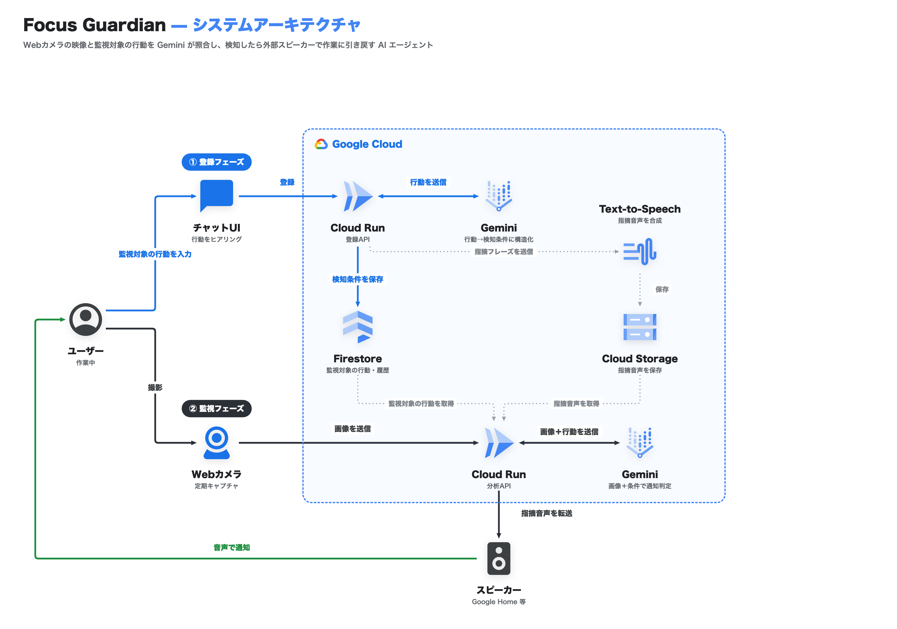

# SHIBAKI（サボり絶対しばく君）

目標実現を支援する監視 AI エージェント。集中したい作業中のあなたを Web カメラで見守り、スマホいじり・居眠りなどの「悪習慣」を Gemini のマルチモーダル画像理解で検知して、あなたが選んだ方法（BGM / 言葉）で Alexa から作業に引き戻します。

DevOps × AI Agent Hackathon 2026 提出作品。

## なぜエージェントか

監視対象の「悪習慣」はユーザごとに自由入力で異なるため、事前学習した分類ラベルが存在しません。SHIBAKI は:

1. 自由入力の悪習慣を **Gemini が画像判定可能な検知条件に構造化**し（ADK エージェント）
2. カメラ画像を**継続的に自律判定**して、介入すべきタイミング（継続時間・不在との区別・再介入の抑制）を自分で決め
3. 介入後の画像で**復帰したかを評価・記録**する

という知覚 → 判断 → 行動のループを人間の指示なしに回し続けます。固定ロジックでは作れない、エージェントであることが必然のプロダクトです。

## アーキテクチャ



**① 登録フェーズ**: ユーザがチャット UI で監視対象の行動を入力すると、登録 API（Cloud Run）が Gemini で検知条件へ構造化して Firestore に保存し、あわせて指摘フレーズを Text-to-Speech で音声合成して Cloud Storage に保存します。

**② 監視フェーズ**: Web カメラが定期キャプチャした画像を分析 API（Cloud Run）へ送信。分析 API は Firestore の監視対象の行動と画像を Gemini に渡して通知要否を判定し、通知する場合は Cloud Storage から指摘音声を取得してスピーカー（Google Home 等）へ転送し、作業へ引き戻します。

- **画像はどこにも保存しません**。判定はリクエストスコープで完結し、Firestore に残るのは構造化された検知条件・判定履歴のみです
- カメラ入力（Web カメラ → Nest Cam）と出力デバイス（スピーカー）は設定変更のみで差し替え可能なアダプタ構成です

## 技術スタック

| 領域 | 技術 |
|---|---|
| AI エージェント | ADK (Agent Development Kit) v2.3 + Vertex AI Gemini 2.5 Flash Lite |
| 音声合成 | Cloud Text-to-Speech (日本語フレーズの MP3 事前生成) |
| 実行基盤 | Cloud Run (単一サービス、フロント同梱) |
| データ | Firestore / Cloud Storage |
| スピーカー連携 | Voice Monkey API v3 (Alexa) |
| バックエンド | Python 3.12 / FastAPI / uv |
| フロントエンド | TypeScript / React 18 / Vite |
| CI/CD | GitHub Actions (test → Cloud Run 自動デプロイ、WIF 認証) |

## 開発

```bash
# バックエンド (フェイクモード: GCP 不要)
cd backend
uv sync
uv run uvicorn app.main:app --reload --port 8000
uv run pytest -q        # テスト
uv run ruff check .     # lint

# フロントエンド
cd frontend
npm install
npm run dev             # http://localhost:5173 (API は :8000 にプロキシ)
```

実サービス接続は環境変数で切り替えます（`backend/app/config.py` 参照）:
`REPOSITORY_BACKEND=firestore` / `AGENTS_BACKEND=adk` / `ASSETS_BACKEND=gcs` / `SPEAKER_ADAPTER=voicemonkey`

## デプロイ

main ブランチへの push で GitHub Actions がテスト → Cloud Run デプロイ → ヘルスチェックまで自動実行します。初期セットアップは `scripts/setup_gcp.sh` と `HUMAN_TODO.md` を参照。
